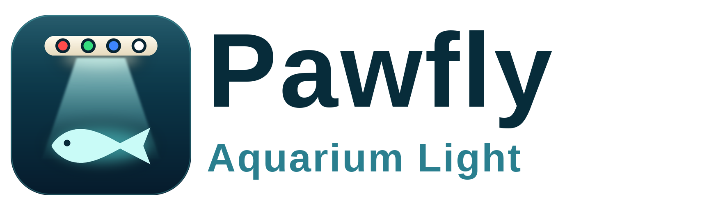

# Pawfly Aquarium Light for Home Assistant

<p align="center"></p>

Local Bluetooth control of the **Pawfly / PinYing PY4C** WRGB submersible aquarium light (the
one with the inline `BT-PF001` controller and the *P-light controller* phone app,
`com.aquapinyin.control`). No cloud, no account: Home Assistant talks to the light through a
local Bluetooth adapter or an ESPHome Bluetooth proxy and keeps the connection open, so control
is instant and the state on screen is what the light reports.

Everything the phone app can do is here, plus the things it hides:

- on/off, master brightness, colour mix (red, green, blue, white) as a normal Home Assistant light;
- the eight built-in scenes as light effects, and the **Demo** replay;
- the three built-in schedule programs (Japanese, Dutch, Jungle style) and your three **DIY**
  programs, readable and writable with a read-back check;
- the light's clock, kept in sync on every connect and every night;
- everything a dashboard card needs (a separate standalone HACS card drives it): live state
  attributes on the light and the schedule actions, no extra websocket commands;
- extras the app does not offer: single-channel writes, live colour preview, password and name
  changes, a clean **release link** for the phone app or before a Home Assistant restart.

## Install

1. HACS -> three dots -> **Custom repositories** -> add `https://github.com/nphil/ha-pawfly` as an
   *Integration*, then download **Pawfly Aquarium Light** and restart Home Assistant.
   (Manual install: copy `custom_components/pawfly` into your `config/custom_components`.)
2. The light is discovered automatically (Bluetooth name `PY4C-...` or `PYLamp-4C-...`). Otherwise
   **Settings -> Devices & services -> Add integration -> Pawfly Aquarium Light**.
3. Enter the light's 8-digit password (new lights use `12345678`). It is checked against the
   light before the entry is created.

Requirements: Home Assistant 2026.6 or newer, and a Bluetooth adapter or ESPHome Bluetooth proxy
that can hear the light. **The light accepts one Bluetooth connection at a time**: while Home
Assistant holds it, the phone app cannot connect (use the *Release link* button to hand it over
for a few minutes), and the other way round.

## What you get

| Entity | What it does |
|---|---|
| `light.<name>` | On/off, brightness (1-255 <-> the light's 1-100 %), colour as `rgbw_color`, effects: `Cloudy`, `Thunderstorm`, `Sunny`, `Moonlight`, `Warm White`, `Bright White`, `Day`, `RGB Cycle`, and `Demo` (only while a program runs). Extra attributes: `mode` (`manual`/`scene`/`program`), `program`, `program_name`, `scenario`. |
| `select.<name>_program` | `manual`, `japanese_style`, `dutch_style`, `jungle_style`, `diy_1`, `diy_2`, `diy_3`. Reflects what the light runs (unknown while a scene runs); `manual` restores the last manual colour. Never changes the power state. |
| `sensor.<name>_mode` | Diagnostic: `manual`, `scene` or `program`. |
| `binary_sensor.<name>_connected` | Diagnostic: is the Bluetooth link up (attributes: link state, proxy, drops in the last hour). |
| `button.<name>_release_link` | Diagnostic: drop the link cleanly and reconnect after 3 minutes. |
| `button.<name>_sync_time` | Config, **disabled by default**: set the light's clock now. |

The main light carries the device's name, so an entry called *Plant Room Aquarium Accent Light*
gives `light.plant_room_aquarium_accent_light` and siblings such as
`select.plant_room_aquarium_accent_light_program`.

How the light behaves, as measured on real hardware (and reflected in the entities):

- The status the light reports for red/green/blue/white is its **manual colour register**. It does
  not change while a scene or program runs. In scene mode the light entity shows the app's own
  scene colours; in program mode it shows the register (use the card for the live curve).
- Brightness is global and never changes the mode. Setting a colour switches the light to manual.
- The three built-in programs live in the phone app, not in the light: `get_program` returns the
  app's curves for them (`source: preset`) without any Bluetooth traffic. DIY 1-3 are stored in the
  light and read back over Bluetooth.
- Programs run on the light's own clock, which forgets the time when power is lost; Home
  Assistant sets it (local time) on every connect and daily at 03:17.
- The light **silently drops** frames that arrive faster than about 20 ms apart, so every write is
  paced 100 ms apart, and DIY uploads are always read back and compared (one automatic retry).
- Selecting an empty DIY slot is accepted and leaves the light dark (a program with no points),
  and Demo replays the running program's 24 hours at one hour per second (about 24 s) and stops
  by itself; any colour, scene or program command ends it early.
- The firmware has an "effect speed" opcode but ignores it (status and animations never change),
  so there is deliberately no speed control. There is no firmware version or model query either.

## Actions

All take `device_id` (the light's device). Errors carry readable messages.

| Action | Purpose |
|---|---|
| `pawfly.get_program` | Points of a program (0-5 or `japanese_style` ... `diy_3`). Returns `{program, slug, name, source, editable, points:[{time, red, green, blue, white}]}`. |
| `pawfly.set_program` | Replace DIY 1-3 with up to 12 points (`time` `HH:MM`, unique; red/green/blue/white 0-100). Writes, reads back, verifies; returns the stored points. |
| `pawfly.set_channel` | Set only the channels you give (0-100 %), leave the rest; manual mode; does not turn the light on. |
| `pawfly.preview` | Show a colour immediately without changing the mode (DIY editor); `end: true` stops it; a preview nobody refreshes for 30 s ends itself. |
| `pawfly.sync_time` | Set the light's clock to Home Assistant's local time. |
| `pawfly.rename` | Change the Bluetooth name (display name without the `PY4C` prefix, up to 16 ASCII characters). |
| `pawfly.change_password` | Change the 8-digit password. The light must accept the new one on a fresh connection before it is saved here; if it cannot be reached in time to confirm, the new password is kept pending and settled the next time the light connects (a light that turns out to still use the old one keeps it). **Give the new password to the phone app too.** |
| `pawfly.release_link` | Drop the link cleanly (all lights, or one), reconnect after `resume_after` seconds (default 180, 0 = stay released). The newest request wins: releasing again replaces the earlier reconnect timer. |

```yaml
action: pawfly.set_program
data:
  device_id: <device id>
  program: diy_1
  points:
    - {time: "07:00", red: 0,  green: 0,  blue: 0,  white: 0}
    - {time: "08:00", red: 70, green: 70, blue: 70, white: 70}
    - {time: "18:00", red: 70, green: 40, blue: 15, white: 0}
    - {time: "22:00", red: 0,  green: 0,  blue: 0,  white: 0}
```

Restarting or stopping Home Assistant does not unload integrations. From 0.2.0 the integration
releases each light's Bluetooth link itself, in Home Assistant's shutdown stage (while Bluetooth
and the ESPHome proxies are still up), so a restart no longer leaves a half-open link that makes the
light stop advertising. `pawfly.release_link` stays for handing the light to the phone app, or for
scripts that still call it before a restart; it unloads the light cleanly, with a hard time limit,
and reports honestly if that failed.

## Options

**Settings -> Devices & services -> Pawfly -> Configure** (changing them reloads the entry):

- **Keep the connection open** (default on): instant control and live state. Off: connect only
  when something needs the light and let go after 30 s of idling (never in the middle of a
  command); state can then be out of date between checks.
- **Status check interval** (default 60 s): how much silence before Home Assistant asks the light
  for its status. The state normally arrives by push; this is a heartbeat.
- **Preferred Bluetooth proxy**: route the connection through the proxy that sits next to the
  light when it can hear it (falls back to Home Assistant's choice otherwise). Choose
  **Automatic** to go back to Home Assistant's own choice.

If the light is unreachable for 15 minutes a **repair** appears (with the proxy that last held it)
and clears itself when the light is back. A password the light stops accepting starts the normal
re-authentication flow.

Starting Home Assistant never waits for the light: setup gives it about 4 seconds, and a light that
has not answered by then keeps connecting in the background while its entities show as unavailable
(they fill in as soon as its first status arrives; nothing is sent to the light when they do).

## For dashboard cards

The Lovelace card is a **separate HACS plugin** (one card for the Pawfly and the Fluval lights); this
integration only has to give it everything without extra websocket commands:

- light attributes that change with the light: `mode` (`manual`/`scene`/`program`), `program`,
  `program_name`, `scenario`, plus the usual `brightness`, `rgbw_color`, `effect`;
- static attributes on the light: `programs` (`[{program, slug, name, editable}]`), `scene_colors`
  (`{scene name: [red, green, blue, white] %}`, the colours the app shows for each scene) and
  `max_program_points`;
- `pawfly.get_program` with a response for schedules (built-in curves and DIY slots),
  `pawfly.set_program` to save, `pawfly.set_channel` and `pawfly.preview` for live sliders;
- `binary_sensor.<name>_connected` for the link, the light itself goes unavailable while it is down.

## Development

```bash
python -m pytest tests -q          # protocol tests + real-Home-Assistant tests with a fake light
python tools/render_brand.py       # re-render custom_components/pawfly/brand/*.png
```

The wire protocol is documented in `docs/PROTOCOL.md`; the vendor app was decompiled with ILSpy
(`research/decompiled/`) and every command was checked against a real light. The HA tests fake
only the light (`tests/ha/fake_light.py`); the link supervisor, coordinator, entities, services
and config flow are the real code.

MIT licensed. Not affiliated with Pawfly or Dongguan PinYing Electronics.
